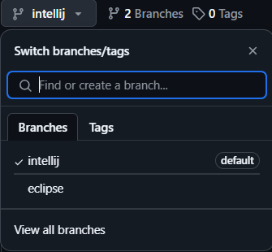
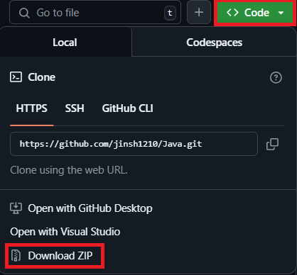

<h1 align="center">
    Java Class / TOC File (IntelliJ)
</h1>

<h4 align="center">
    자바 프로그래밍 응용 / TOC 멘토링 자료
</h4>

---

## 📁 프로젝트 구조

├── Java/

│.....└── src/main/java/

│.............└── 패키지 [ classes / toc ]

│.....................└── Main.java (또는 실행 클래스)

├── pom.xml

└── README.md

---

## ⚙️ 개발 환경

- **Java 버전:** JDK 21
- **빌드 도구:** Maven
- **IDE 추천:** IntelliJ IDEA

---

## 🛠️ 실행 방법

### 1. GitHub에서 클론

```bash
git clone https://github.com/jinsh1210/Java.git
```

### 2. 사용하고자 하는 브랜치 Download ZIP 받아서 기존 src파일에 붙여넣기

 
